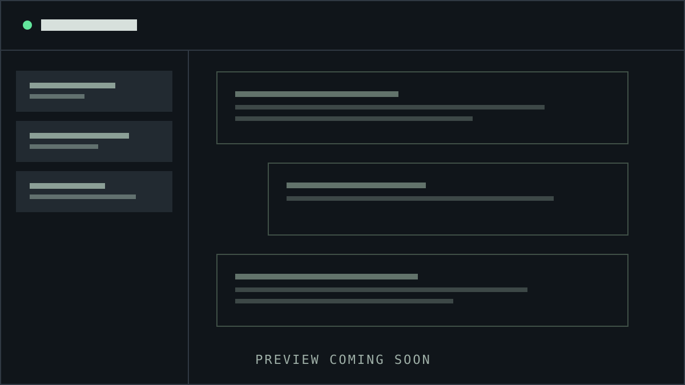
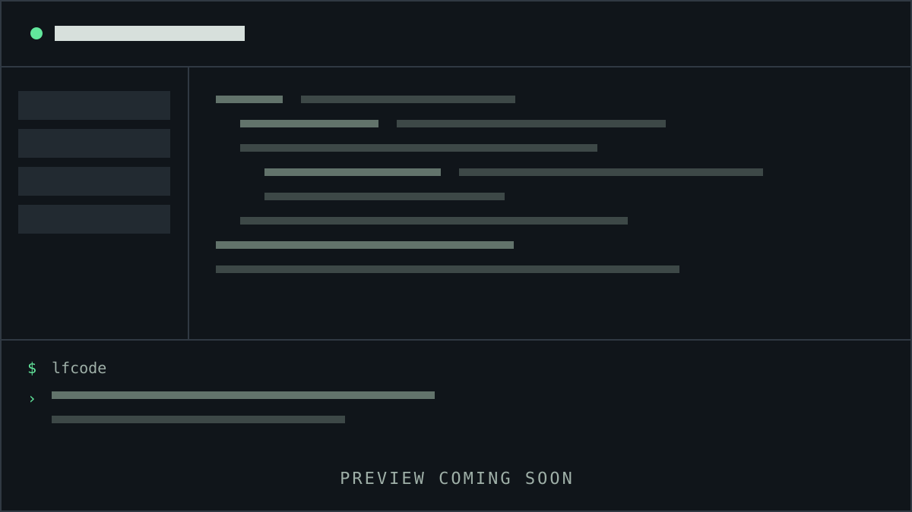
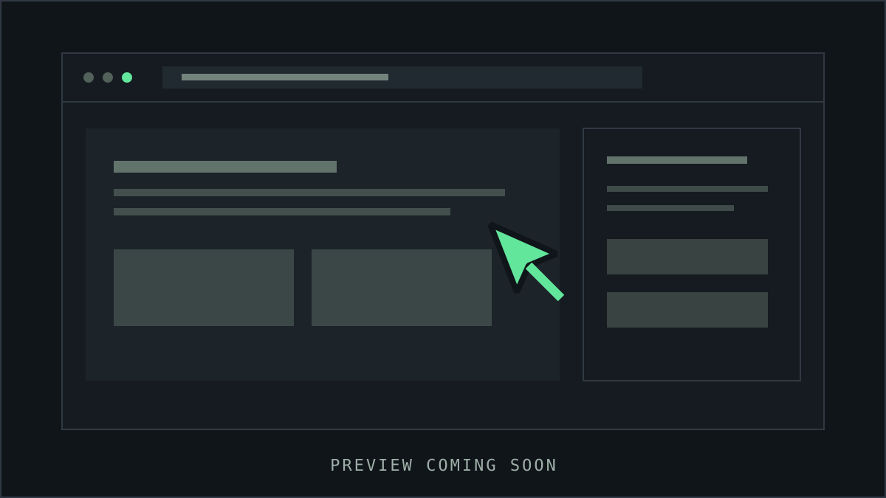
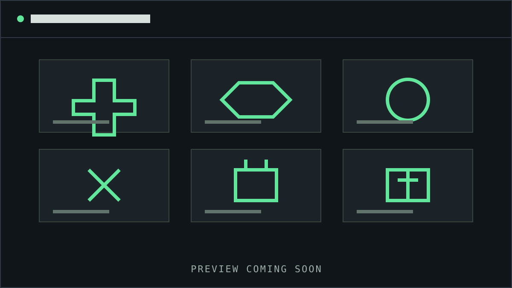

<p align="center">
  <a href="https://github.com/lfyxhappy/lfcode">
    <picture>
      <source srcset=".github/readme/lfcode-wordmark-dark.svg" media="(prefers-color-scheme: dark)">
      <source srcset=".github/readme/lfcode-wordmark-light.svg" media="(prefers-color-scheme: light)">
      
    </picture>
  </a>
</p>
<p align="center"><strong>Uno spazio di lavoro AI per il coding, local-first e open source.</strong></p>
<p align="center">Riunisci chat, modifica del codice, terminale, browser, Skills e automazione in un unico ambiente desktop.</p>
<p align="center">
  <a href="https://github.com/lfyxhappy/lfcode/releases"></a>
  <a href="https://github.com/lfyxhappy/lfcode/actions/workflows/publish.yml"></a>
  <a href="LICENSE"></a>
</p>
<p align="center">
  <a href="https://github.com/lfyxhappy/lfcode/releases">Download</a> ·
  <a href="#quick-start">Quick start</a> ·
  <a href="https://github.com/lfyxhappy/lfcode/issues">Issues</a>
</p>

<p align="center">
  <a href="README.en.md">English</a> |
  <a href="README.md">简体中文</a> |
  <a href="README.zh.md">简体中文（备用）</a> |
  <a href="README.zht.md">繁體中文</a> |
  <a href="README.ko.md">한국어</a> |
  <a href="README.de.md">Deutsch</a> |
  <a href="README.es.md">Español</a> |
  <a href="README.fr.md">Français</a> |
  <a href="README.it.md">Italiano</a> |
  <a href="README.da.md">Dansk</a> |
  <a href="README.ja.md">日本語</a> |
  <a href="README.pl.md">Polski</a> |
  <a href="README.ru.md">Русский</a> |
  <a href="README.bs.md">Bosanski</a> |
  <a href="README.ar.md">العربية</a> |
  <a href="README.no.md">Norsk</a> |
  <a href="README.br.md">Português (Brasil)</a> |
  <a href="README.th.md">ไทย</a> |
  <a href="README.tr.md">Türkçe</a> |
  <a href="README.uk.md">Українська</a> |
  <a href="README.bn.md">বাংলা</a> |
  <a href="README.gr.md">Ελληνικά</a> |
  <a href="README.vi.md">Tiếng Việt</a>
</p>

## Vantaggi principali

LFCODE mantiene l'intero flusso di sviluppo in un unico posto:

- **Sessioni** — Organizza conversazioni lunghe, riprendi il lavoro e consulta la cronologia di ogni attività.
- **Editor e terminale** — Passa tra modifiche, comandi e risultati senza lasciare lo spazio di lavoro.
- **Browser e automazione** — Esegui flussi del browser e attività ripetibili nello stesso contesto.
- **Skills ed estensioni** — Amplia le capacità con Skills, MCP, plugin e strumenti personalizzati.

## Anteprima delle funzioni

Queste anteprime rappresentano le quattro aree principali e saranno sostituite in seguito da schermate reali.

<table>
  <tr>
    <td></td>
    <td></td>
  </tr>
  <tr>
    <td align="center"><strong>Sessioni</strong></td>
    <td align="center"><strong>Editor e terminale</strong></td>
  </tr>
  <tr>
    <td></td>
    <td></td>
  </tr>
  <tr>
    <td align="center"><strong>Browser e automazione</strong></td>
    <td align="center"><strong>Skills ed estensioni</strong></td>
  </tr>
</table>

<a id="quick-start"></a>
## Avvio rapido

### Installazione su Windows

Apri [Releases](https://github.com/lfyxhappy/lfcode/releases), scarica `lfcode-win-x64.exe` dall'ultima versione e avvia il programma di installazione.

### Comando principale

`lfcode` è il comando CLI ufficiale:

```bash
lfcode
lfcode --help
```

### Avvio dal codice sorgente

Lo sviluppo locale richiede Bun. Esegui nel terminale:

```bash
git clone https://github.com/lfyxhappy/lfcode.git
cd lfcode
bun install
bun run dev
```

## Architettura ed estensibilità

Il repository è un monorepo Bun. Il runtime si trova in `packages/lfcode`, l'interfaccia web in `packages/app`, l'host Electron in `packages/desktop`, la UI condivisa in `packages/ui` e l'SDK JavaScript in `packages/sdk/js`. LFCODE può essere esteso con Skills, strumenti MCP, plugin, comandi e automazioni.

## Compatibilità

Per mantenere attivi i flussi precedenti, alcuni identificatori storici e l'alias `opencode` restano supportati. Nella nuova documentazione e nell'uso quotidiano, usa il nome LFCODE e il comando `lfcode`.

## Contributi e supporto

I contributi sono benvenuti. Usa [Issues](https://github.com/lfyxhappy/lfcode/issues) per errori e proposte, e consulta [Releases](https://github.com/lfyxhappy/lfcode/releases) per download e modifiche.

LFCODE è distribuito con [licenza MIT](LICENSE).
